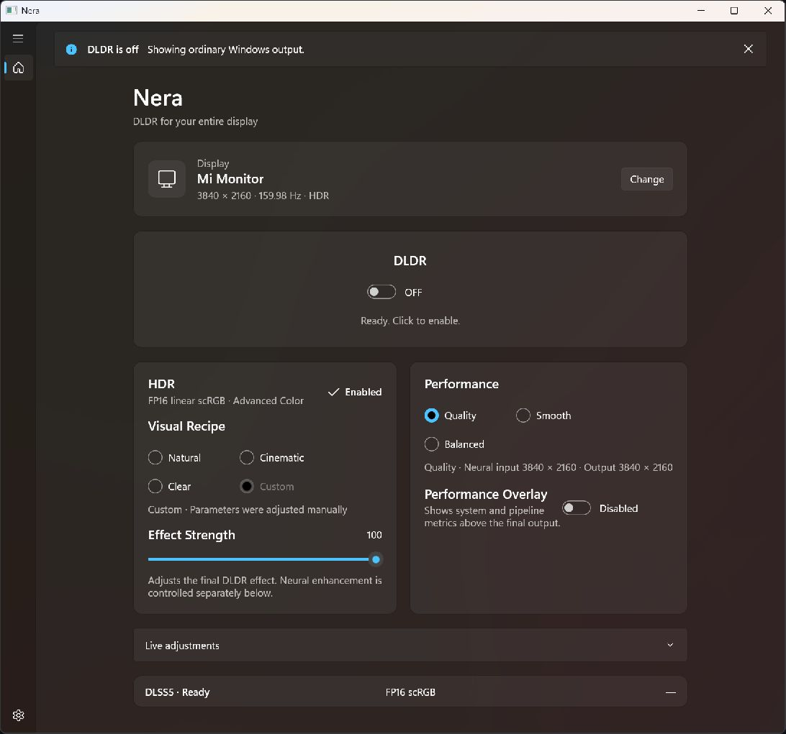
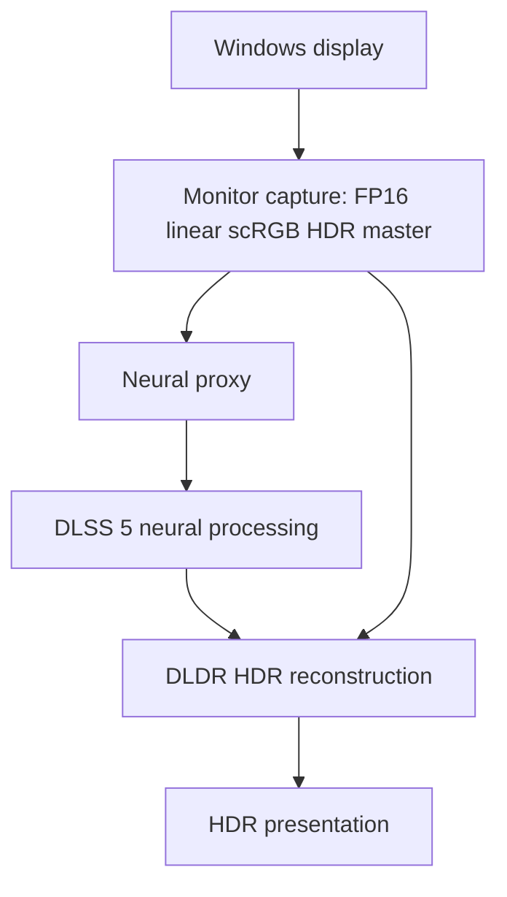

# Nera

**Experimental display-wide DLSS 5 Neural Rendering + HDR for Windows.**

[](https://github.com/Ka1y0/Project_Nera/actions/workflows/source-preview.yml)

Nera explores a single neural rendering layer for an entire Windows display.
Turn on **DLDR**, then continue using your desktop, images, videos and games normally—without selecting each application or installing a game integration.

The internal Windows prototype combines neural processing with HDR reconstruction, live visual controls and explicit recovery paths. This repository opens its reviewed control-plane source for developers to inspect and test.



*Current Nera main UI in English, with DLDR OFF. The public repository currently provides a source preview; the complete runnable DLDR application is not yet distributed here.*

## Highlights

The internal prototype brings together:

- **Display-wide processing:** one global DLDR ON/OFF workflow instead of per-app targeting.
- **HDR-first reconstruction:** an FP16 linear scRGB master retained throughout the HDR pipeline.
- **Explicit performance choices:** Quality, Balanced and Smooth modes, with real neural input and final output dimensions shown.
- **Live visual controls:** visual recipes, effect strength and expandable neural/HDR adjustments.
- **An optional performance HUD:** system and pipeline metrics above the final output.
- **Recovery and emergency controls:** ON is gated on a successful displayed frame; failures must return to the original display.
- **AI-native local control:** UI, hotkeys, CLI and MCP share a canonical command/state model.
- **A multilingual application:** English, Simplified Chinese and Traditional Chinese.

These describe the product architecture and internal implementation, not the executable capabilities of the public source preview.

## What Nera is designed to do

Nera treats neural rendering as a display mode rather than a media player, window picker or game modification. **DLDR** is the user-facing name for that global mode: neural processing plus Nera's HDR reconstruction and presentation.

The neural input is a proxy derived from the original HDR frame. DLDR reconstructs the processed result using that HDR master, aiming to retain highlight range and color instead of presenting the neural proxy as SDR. It is an experimental image-processing pipeline, not a guarantee of unchanged artistic intent or artifact-free output.

## DLDR architecture

The internal graphics pipeline is conceptually:



Conceptually: `HDR Final = Reconstruct(HDR Master, Neural Proxy, Neural Result, DLDR parameters)`.

`Nera.Control` is the authority for commands, state revisions, permissions and lifecycle recovery. UI, hotkeys and local AgentBridge interfaces use that same control contract. The full graphics backend is separate from the public components described below.

## What is public today?

**Nera v0.5.0-alpha.2 Source Preview** contains real managed control-plane and AgentBridge source, executable fake-backend contract tests, localization resources and standalone native safety policies.

It does **not** distribute `Nera.exe`, the complete WinUI application, operational monitor capture/HDR Presenter, RuntimeBroker, Feature18CompatHost, the private compatibility adapter, NVIDIA Runtime or proprietary NVIDIA SDK libraries. There is no end-user Portable application in this release. Importing a Runtime cannot turn this subset into the full product.

The screenshot is a current capture of the separately maintained internal application, not a mockup or a graphics test result. A temporary, OFF-only capture-exclusion diagnostic enabled this capture; it did not change the UI controls or processing parameters and was removed afterward.

### Source map

| Project | Included purpose |
|---|---|
| `src/Nera.Control` | Canonical state, command/permission/lifecycle contracts, local pipe server and hotkeys |
| `src/Nera.AgentBridge` | CLI and stdio MCP adapters; no direct Runtime loading |
| `src/Nera.Localization` | Three-language messages and preferences; private feature registry excluded |
| `src/Nera.Control.Tests` | Fake-backend state, recovery, revision, framing and hotkey contracts |
| `src/Nera.AgentBridge.Tests` | CLI/MCP/schema/permission/wire compatibility contracts |
| `native-safety` | Standard-library-only C++20 policies and tests |

`SOURCE_PREVIEW_BUILD.json` declares the exact five-project managed build selection. The internal `Nera.Localization.Tests` project is excluded because it links an App settings file; localization is still compiled and exercised by the included contracts and audit. `ExperimentalFeatureRegistry.cs` is excluded because private Runtime key metadata is unnecessary for this preview.

## Build and test

Use Windows 11 x64, 64-bit PowerShell 7 and .NET 10 SDK (tested with 10.0.400). The managed build needs no Visual Studio, GPU SDK, NVIDIA DLL, administrator permission, game or cloud key. Reference-pack restore may use configured NuGet sources when required packs are not cached; it never downloads a graphics Runtime or installs an SDK.

```powershell
pwsh -File .\build-source-preview.ps1
```

The script checks the dependency closure, copies only declared source into a new temporary tree, builds Release x64, and runs `Nera.Control.Tests` and `Nera.AgentBridge.Tests`. It prints the output directory and writes `source-preview-build-result.json` there. Existing output is not overwritten or deleted.

```powershell
pwsh -File .\build-source-preview.ps1 -BuildOnly
pwsh -File .\build-source-preview.ps1 -OutputRoot "$env:TEMP\Nera-preview-my-new-run"
```

Tests use fake backends, temporary local files and isolated current-user pipes. One Windows smoke test briefly registers/unregisters a Ctrl+Alt+Shift+F22–F24 candidate; it never sends input. Tests do not launch the product, change Windows HDR, capture a display or load a Runtime. **Contract success is not proof of neural rendering, HDR output, performance or visible image change.**

### Native safety policies

The standalone C++20 suite models capture-probe validity, startup-retry qualification, rolling timing, HUD evidence and safe-OFF cleanup. It does not execute process termination, capture or HDR. With CMake and an x64 C++20 compiler installed:

```powershell
cmake -S native-safety -B "$env:TEMP/NeraNativePreview" -A x64
cmake --build "$env:TEMP/NeraNativePreview" --config Release
ctest --test-dir "$env:TEMP/NeraNativePreview" -C Release --output-on-failure
```

Build outside the source tree. See [native safety policies](native-safety/README.md) for exact boundaries.

## AI-native interface

The public AgentBridge implements CLI formatting and exit codes, stdio MCP discovery/schema/dispatch and framed local pipe transport. It is a client, not another renderer or an independent state machine. This preview supplies no product control service; tests use isolated fake endpoints, not a separately installed Nera instance.

Read the [AI-native overview](docs/AI_NATIVE.md), [CLI guide](docs/CLI.md), [MCP guide](docs/MCP.md) and [agent contribution guide](AGENTS.md).

## Localization

The application supports `en-US`, `zh-CN` and `zh-TW`. Follow system stays first; explicit languages sort by canonical English names: English, Simplified Chinese, Traditional Chinese. Their displayed names use each language's own name, without region labels. This ordering is independent of the selected UI language.

Application localization is separate from the repository's **English-only public documentation policy**.

## Safety and privacy

- The internal product uses external capture and presentation: no game injection, game DLL replacement, driver modification or Windows system-file changes.
- The control model requires fresh first-frame evidence, bounded messages, permissions, revision checks and explicit recovery. Missing telemetry stays unavailable rather than guessed.
- The public control surface exposes no arbitrary shell, driver changes, game injection, credential access or screen-pixel access. Its transports are local stdio and current-user Windows Named Pipes, not a TCP/HTTP control listener.
- The internal emergency fallback is **Ctrl + Alt + Backspace**. This source preview does not install a global product emergency handler.
- NVIDIA Runtime is not bundled or downloaded by the preview. The internal experiment leaves the Runtime file on disk unchanged and uses in-memory caller compatibility in an isolated Host; that omitted adapter is not an official NVIDIA SDK contract.
- User content, credentials, private paths, local grants, logs and internal development history are excluded. The sole reviewed documentation PNG is path- and SHA-256-pinned by the source scanner; other images remain forbidden.

See [SECURITY.md](SECURITY.md) and [KNOWN_LIMITATIONS.md](KNOWN_LIMITATIONS.md). No current public test suite qualifies real graphics behavior or hardware compatibility.

## Release status

[v0.5.0-alpha.2 Source Preview](https://github.com/Ka1y0/Project_Nera/releases/tag/v0.5.0-alpha.2) is experimental engineering material, not a production-ready application. The release archive includes reviewed source, a manifest and a source SPDX SBOM. The README showcase is a later documentation update; the existing tagged release and its assets remain unchanged.

Public product binaries remain blocked pending private compatibility/identity permissions and other release gates. User-imported Runtime distribution alone does not resolve those rights. No general game-support, performance or supported-hardware guarantee is made here.

## License and provenance

The reviewed source subset is [MIT-licensed](LICENSE) by authorization of the project owner; this does not grant rights to omitted components or third-party SDKs/Runtime. The documentation screenshot is publication-authorized; it does not redistribute font binaries or grant rights to third-party UI marks. Its SPDX license conclusion is kept separate from the source-code license.

See [LICENSE_AUDIT.md](LICENSE_AUDIT.md), [THIRD_PARTY_NOTICES.md](THIRD_PARTY_NOTICES.md) and [PROVENANCE.md](PROVENANCE.md).

Source package/assembly metadata remains `0.5.0-alpha.2`. Protocol 7 and inherited `0.4.1` handshake constants identify a separately versioned application contract, not a shipped application binary.

## Credits

Nera is an experimental project by **Chips Studio / Ka1y0**.

Thanks to NVIDIA for the neural graphics technologies explored by this research, and to the Microsoft/.NET and open-source tooling communities. Nera is not affiliated with, endorsed by or an official product of NVIDIA or Microsoft. Third-party names and trademarks belong to their respective owners.
