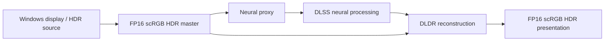

# Nera

**Experimental display-wide DLSS 5 Neural Rendering + HDR for Windows.**

[](https://github.com/Ka1y0/Project_Nera/actions/workflows/source-preview.yml)

Nera explores a simple idea: neural rendering should not have to stop at the boundary of a game or media application. The product is designed to apply a neural rendering and HDR reconstruction pipeline to an entire Windows display, so one display-wide mode can cover desktop content, browsers, images, video, and compatible games.

The user-facing global mode is **DLDR**. The intended interaction is straightforward: select a display, enable DLDR, continue using Windows normally, and turn it off when you want the untouched output again.

> [!IMPORTANT]
> This repository currently publishes **Nera v0.5.0-alpha.2 Source Preview**, not the complete application. There is no public `Nera.exe` or working DLDR Portable binary here yet. The public tree contains the reviewed control plane, AgentBridge, localization layer, native safety policies, tests, and source-build tooling. The WinUI application, display capture and HDR Presenter, RuntimeBroker, operational Feature18 compatibility adapter, NVIDIA SDK libraries, and NVIDIA Runtime are not included.

## What Nera is designed to do

- **Display-wide neural rendering.** Process the selected Windows display rather than requiring a separate integration for every application.
- **HDR-first reconstruction.** Keep an untouched FP16/scRGB HDR master, derive a neural proxy, then reconstruct the neural changes back into the HDR output instead of treating SDR tone mapping as HDR.
- **One global DLDR mode.** A single ON/OFF state controls the display-wide processing path.
- **Quality and performance profiles.** The product architecture supports quality-oriented, balanced, and performance-oriented operating modes rather than exposing raw internal parameters as the primary experience.
- **Real-time visual controls.** The full product design includes visual recipes and bounded tuning controls for neural-rendering and HDR reconstruction behavior.
- **On-screen performance feedback.** The product design includes a lightweight HUD for presenter FPS, 1% low, GPU usage, and neural-processing time where those values are actually available.
- **Keyboard-first safety controls.** Hotkeys, explicit OFF behavior, lifecycle recovery, and an emergency-stop path are part of the control model.
- **AI-native control.** The same canonical control surface is exposed through local CLI and stdio MCP interfaces so agents can inspect and operate Nera without coordinate-based UI automation.
- **Multilingual application UI.** The application supports English, Simplified Chinese, and Traditional Chinese, with Follow system pinned first in the language selector.

## DLDR architecture

The full product architecture keeps HDR preservation separate from neural processing:



Conceptually:

```text
HDR Final = Reconstruct(HDR Master, Neural Proxy, Neural Result, DLDR parameters)
```

This is deliberately different from applying a neural pass to an SDR image and then labeling the result HDR.

## Public source preview

The public repository focuses on the parts that can be released and tested independently of the private rendering compatibility layer.

| Project | Included purpose |
| --- | --- |
| `src/Nera.Control` | Canonical state, command, permission, lifecycle, pipe-server, and hotkey contracts |
| `src/Nera.AgentBridge` | Real CLI and stdio MCP adapters; no direct Runtime loading |
| `src/Nera.Localization` | Application messages for English, Simplified Chinese, and Traditional Chinese |
| `src/Nera.Control.Tests` | Fake-backend state, recovery, revision, framing, and hotkey contracts |
| `src/Nera.AgentBridge.Tests` | CLI, MCP, schema, permission, and wire-compatibility contracts |
| `native-safety` | Standard-library-only C++ safety-policy models and deterministic tests |

The public tests exercise real control and protocol code with isolated fake backends. A passing test proves those contracts only. It does **not** prove DLSS processing, HDR output, graphics performance, input safety, or visible image quality.

`SOURCE_PREVIEW_BUILD.json` declares the exact managed source selection. `PUBLIC_SOURCE_ALLOWLIST.json` and the source-package tooling define the reviewed publication boundary.

## Build and test

### Managed source preview

Requirements:

- Windows 11 x64
- 64-bit PowerShell 7
- .NET 10 SDK

The current source preview was validated with .NET SDK 10.0.400. The managed build requires no Visual Studio installation, GPU SDK, NVIDIA DLL, administrator permission, game, or cloud key.

```powershell
pwsh -File .\build-source-preview.ps1
```

The script validates the five-project managed dependency closure, copies only the declared source selection into a new temporary directory, builds Release x64 there, and runs `Nera.Control.Tests` and `Nera.AgentBridge.Tests`.

Optional forms:

```powershell
pwsh -File .\build-source-preview.ps1 -BuildOnly
pwsh -File .\build-source-preview.ps1 -OutputRoot "$env:TEMP\Nera-preview-my-new-run"
```

Build output must remain outside the source tree. Existing output is not overwritten or deleted.

### Native safety policies

With CMake and an x64 C++20 compiler installed:

```powershell
cmake -S native-safety -B "$env:TEMP/NeraNativePreview" -A x64
cmake --build "$env:TEMP/NeraNativePreview" --config Release
ctest --test-dir "$env:TEMP/NeraNativePreview" -C Release --output-on-failure
```

The native suite validates pure policy models. It does not perform display capture, process termination, HDR restoration, or neural rendering.

## AI-native interface

Nera's machine-facing control layer is intentionally local and structured:

- [`docs/AI_NATIVE.md`](docs/AI_NATIVE.md) — control-surface model and safety boundaries
- [`docs/CLI.md`](docs/CLI.md) — command-line interface
- [`docs/MCP.md`](docs/MCP.md) — local stdio MCP interface

The intended transports are local stdio and a current-user-only Windows Named Pipe. No public TCP/HTTP control listener or cloud credential is required by this source preview.

## Localization

The application localization layer supports:

1. Follow system
2. English
3. Simplified Chinese
4. Traditional Chinese

Follow system is always pinned first. Other languages are ordered by their canonical English language names so the order remains stable regardless of the current UI language.

Repository-facing documentation remains English-only. Application localization is a separate product layer and remains multilingual.

## Safety model

Nera's control design is fail-closed around display ownership and recovery:

- Mutable product state belongs to the canonical Control layer rather than to UI, CLI, MCP, or hotkey adapters.
- ON requires current-session first-frame evidence; adapters may not invent a successful state.
- OFF and recovery require explicit restoration and cleanup evidence.
- The public control surface does not expose arbitrary shell execution, driver changes, game injection, credential access, screen-pixel access, or operating-system security bypasses.
- Public assets exclude proprietary Runtime files, private compatibility adapters, local grants, user media, private paths, credentials, and internal development history.

See [`SECURITY.md`](SECURITY.md) for the full public threat model and [`KNOWN_LIMITATIONS.md`](KNOWN_LIMITATIONS.md) for current boundaries.

## Release status

**Current public release: `v0.5.0-alpha.2` Source Preview.**

There is no end-user Portable build in this repository yet. The operational rendering application remains gated separately by compatibility/identity publication permissions and physical release validation. Importing a Runtime cannot turn this stripped source preview into the complete application.

Release assets include the reviewed source archive, source manifest, SPDX SBOM, and SHA-256 checksums. Hosted CI validates the public source/build contracts only; it does not test the private neural-rendering backend.

## License and provenance

The reviewed public source subset is released under the [MIT License](LICENSE) by authorization of the project owner. MIT applies only to the supplied Nera source and does not grant rights to omitted components, NVIDIA SDK material, proprietary Runtime files, or other third-party software.

See:

- [`LICENSE_AUDIT.md`](LICENSE_AUDIT.md)
- [`THIRD_PARTY_NOTICES.md`](THIRD_PARTY_NOTICES.md)
- [`PROVENANCE.md`](PROVENANCE.md)
- [`SECURITY.md`](SECURITY.md)
- [`KNOWN_LIMITATIONS.md`](KNOWN_LIMITATIONS.md)

Nera is an independent experimental project and is not affiliated with or endorsed by NVIDIA. DLSS and DLSS Neural Rendering are technologies developed by NVIDIA. We thank NVIDIA and its researchers and engineers for advancing real-time neural rendering and for making this line of experimentation possible.

## Credits

Built by **Chips Studio / Ka1y0**.

Canonical repository: [Ka1y0/Project_Nera](https://github.com/Ka1y0/Project_Nera)
